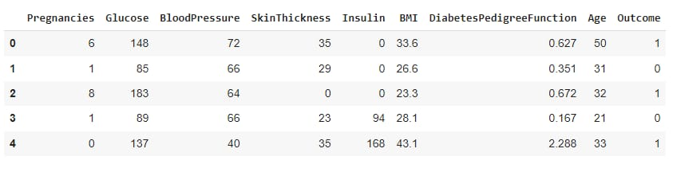
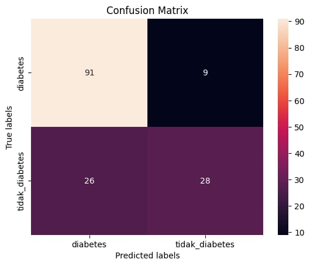
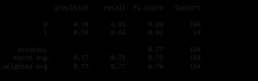
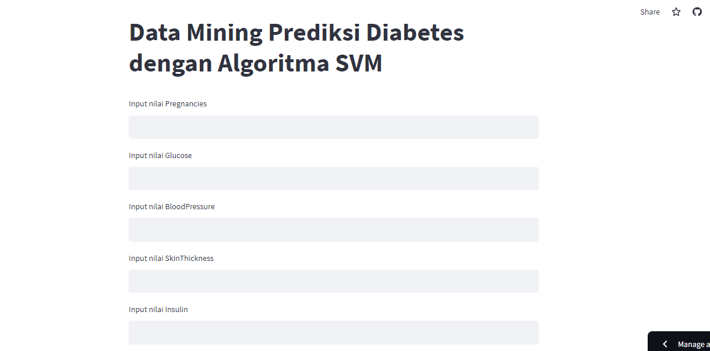
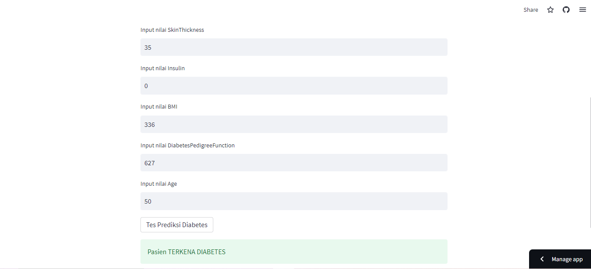

## Laporan Proyek Machine Learning
### Nama : An Nada Z Nabila
### Nim : 211351017
### Kelas : Malam A

## Domain Proyek
Dalam kasus ini, sebuah model telah dilatih dengan menggunakan informasi medis seperti kadar glukosa darah, kadar insulin pasien,  dan apakah orang tersebut menderita diabetes atau tidak sebagai label. Data tersebut dimasukkan ke dalam model support vector machine dan dilakukan plotting. Hasil plotting menunjukkan adanya hyperplane yang memisahkan kedua kelompok data. Ketika data baru dimasukkan ke dalam model, model tersebut akan mencoba menempatkan data tersebut ke dalam salah satu kelompok untuk memprediksi apakah orang tersebut akan menderita diabetes atau tidak.
## Business Understanding
Dibutuhkan seseorang yang lebih propesional/ahli agar lebih mendapatkan penanganan khusus.
## Problem Statments
Banyaknya yang menderita diabetes diduga berkaitan dengan gaya hidup dan pola makan yang memainkan peran utama dalam penyakit tersebut. Maka dariitu semakin banyak yang harus ditangani.
## Goals
Memudahkan seorang ahli dalam meprediksi apakah pasien mengidap diabetes / tidak mengidap diabetes dengan menggunakan aplikasi berbasis web.

## Data Understanding
DataSet yang digunakan untuk menyelesaikan permasalahan yaitu 'Prediction diabetes dataset', yang dapatkan dari website Kaggle. Dataset ini memiliki 9 kolom dan 769 baris. Berikut Link menuju datasetnya.<br>

[diabetes-dataset](https://www.kaggle.com/datasets/akshaydattatraykhare/diabetes-dataset/data)
## Variabel - Variabel pada Diabetes Dataset adalah sebagai berikut :
- Pregnancies : Kehamilan (Untuk menyatakan Jumlah kehamilan) 
- Glucose : Untuk menyatakan kadar Glukosa dalam darah.
- BloodPressure : Tekanan Darah (Untuk menyatakan pengukuran tekanan darah)
- SkinThickness : Untuk menyatakan ketebalan kulit.
- Insulin: Untuk menyatakan kadar Insulin dalam darah.
- BMI: Untuk menyatakan indeks massa tubuh.
- DiabetesPedigreFunction : Untuk menyatakan persentase Diabetes.
- Age : Untuk menyatakan usia.
- Outcame : Untuk menyatakan hasil akhir 1 adalah Ya dan 0 adalah Tidak.

## Data Preparation
Untuk data preparation ini saya melakukan EDA (Exploratory Data Analysis) terlebih dahulu, lalu melakukan proses Standarisasi data dengan mentransform data agar model yang dihasilkan memiliki tingkat akurasi yang tinggi.

Berikut langkah-langkah untuk data preparation, dimulai dari mendownload dataset dari kaggle seperti berikut :

```javascript
from google.colab import files
files.upload()
```

Selanjutnya kita membuat folder untuk menampung file kaggle yang sudah di upload

```javascript
!mkdir -p ~/.kaggle
!cp kaggle.json ~/.kaggle/
!chmod 600 ~/.kaggle/kaggle.json
!ls ~/.kaggle
```

Lalu downloads dataset menggunakan kode berikut

```javascript
!kaggle datasets download -d akshaydattatraykhare/diabetes-dataset
```

Selanjutnya ekspor dataset ke dalam sebuah folder

```javascript
!mkdir diabetes-dataset
!unzip diabetes-dataset.zip -d diabetes-dataset
!ls diabetes-dataset
```

Dataset sudah terdownload dan sudah di ekstrak dalam folder dengan nama file diabetes.csv 
Selanjutnya impor semua libary yang akan digunakan.

```javascript
import numpy as np
import pandas as pd
import matplotlib.pyplot as plt
import seaborn as sns
```

Lalu kita baca file dataset diabetes.csv dan melihat 5 data pertama dari diabetes_dataset

```javascript
diabetes_dataset = pd.read_csv('/content/diabetes-dataset/diabetes.csv')
diabetes_dataset.head()
```


Selanjutnya kita bisa melihat jumlah baris dan kolom yang ada pada dataset

```javascript
diabetes_dataset.shape
```

Selanjutnya kita akan menjumlahkan data yang terkena diabates dan yang tidak terkena diabetes

```javascript
diabetes_dataset['Outcome'].value_counts()
```

Lalu kita akan memisahkan antara data diagnosa dan data label

```javascript
x = diabetes_dataset.drop(columns='Outcome', axis=1)
y = diabetes_dataset['Outcome']
```

Kita akan melihat terdapat data apa saja yang ada di variabel x dan y

```javascript
print(x)
print(y)
```

Selanjutnya kita akan menstandarisasi data

```javascript
scaler = StandardScaler()
scaler.fit(x)
```

Dan ini untuk transform data x nya
```javascript
data_standar = scaler.transform(x)
```

Disini kita bisa print data standar yang sudah di transform
```javascript
print(data_standar)
```

## Modeling
Model data mining yang akan saya gunakan adalah dengan menggunakan model Support Vector Machine (SVM),langkah yang pertama dilakukan masukan semua library yang akan digunakan pada proses pembuatan

```javascript
from sklearn.preprocessing import StandardScaler
from sklearn.model_selection import train_test_split
from sklearn import svm
from sklearn.metrics import accuracy_score
```

```javascript
model = svm.SVC(kernel='linear')
model.fit(x_train, y_train)
```

Setelahnya kita lakukan split data training dan data testing dengan persentase 20% atau 0.2
```javascirpt
x_train,x_test,y_train,y_test = train_test_split(x, y, test_size=0.2, stratify=y, random_state=2)
```

Lalu kita cetak data yang sudah dipecah
```javascript
print(x.shape, x_train.shape, x_test.shape)
```
hasil yang didapat untuk jumlah data sama dengan 768, junlah data training sama dengan 614 dan jumlah data testing sama dengan 154.

Dan tahap selanjutnya adalah membuat data latih menggunakan algoritma SVM.

```javascript
model = svm.SVC(kernel='linear')
print(x.shape, x_train.shape, x_test.shape)
```
```javascript
model.fit(x_train, y_train)
```
Setelah model svm diterapkan, tahap selanjutnya adalah membuat model evalusi untuk mengukur tingkat akurasi
```javascript
x_train_prediction = model.predict(x_train)
training_data_akurasi = accuracy_score(x_train_prediction, y_train)
print('Akurasi data training = ', training_data_akurasi)

x_test_prediction = model.predict(x_test)
test_data_akurasi = accuracy_score(x_test_prediction, y_test)
print('Akurasi data Testing = ', test_data_akurasi)
```
Nilai akurasi dari data training sekitar 78% dan untuk data testing sekitar 77%.

Tahap selanjutnya adalah membuat model prediksi dengan nilai berasal dari data inputan
```javascript
input_data = (6, 148, 72, 35, 0, 33.6, 0.627, 50)
input_data_as_array = np.array(input_data)
input_datareshape = input_data_as_array.reshape(1,-1)

std_data = scaler.transform(input_datareshape)
prediction = model.predict(std_data)
if(prediction[0] == 0) :
    print('Pasien TIDAK terkena DIABETES')
else :
    print('Pasien TERKENA DIABETES')
```

Dan hasilnya yang diterima adalah pasien yang terkena diabetes,sebelum menyelesaikan prediksi data ini kita perlu meng eskpor modelnya menggunakan pickle agar nanti bisa digunakan pada media lain.

```javascript
filename = '/content/diabetes_model.sav'
pickle.dump(model, open(filename,'wb'))
```

## Evaluasi
Saya menggunakan confusion matrix untuk mengevaluasi model yang sudah dibuat sebelumnya.

```javascript
from sklearn.metrics import confusion_matrix
y_pred = model.fit(x_train, y_train).predict(x_test)
confusion_matrix = confusion_matrix(y_test,y_pred)
```
Berikut visualisasi dari confusion matrix untuk memudahkan dalam mengevaluasi.
```javascript
import seaborn as sns
import matplotlib.pyplot as plt
ax= plt.subplot()
sns.heatmap(confusion_matrix, annot=True, fmt='g', ax=ax);
ax.set_xlabel('Predicted labels');ax.set_ylabel('True labels');
ax.set_title('Confusion Matrix');
ax.xaxis.set_ticklabels(['diabetes','tidak_diabetes']); ax.yaxis.set_ticklabels(['diabetes','tidak_diabetes']);
```


Disitu terlihat jelas bahwa model kita berhasil memprediksi nilai diabetes yang sama dengan nilai aktualnya sebanyak 91 data.

Dengan confusion matrix kita dapat mengetahui keakuratan dari model yang kita buat dengan performance metrics seperti: accuracy, recall, dan precision.
```javascript
from sklearn.metrics import classification_report
y_pred = model.fit(x_train, y_train).predict(x_test)
classification_report = classification_report(y_test,y_pred)

print (classification_report) 
```

Hasil pengujian yang diperoleh menggunakan metode confusion matrix pada model yang dibuat menggunakan algoritma Support Vector Machine yang memberikan hasil nilai accuracy 77%, precission 78%, recall 91%, dan F1-SCORE 84%
## Deployment
[diabetes dataset app](https://diabetesdataset-grporgxltezrwvkzndhseh.streamlit.app/)


